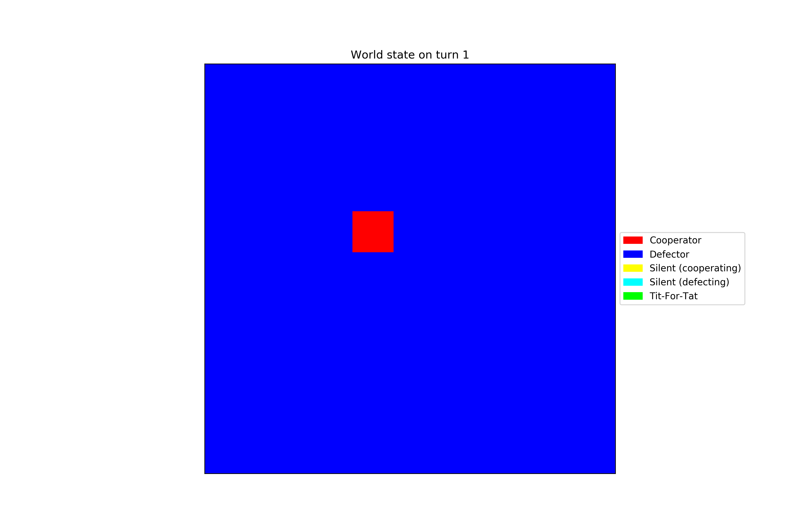
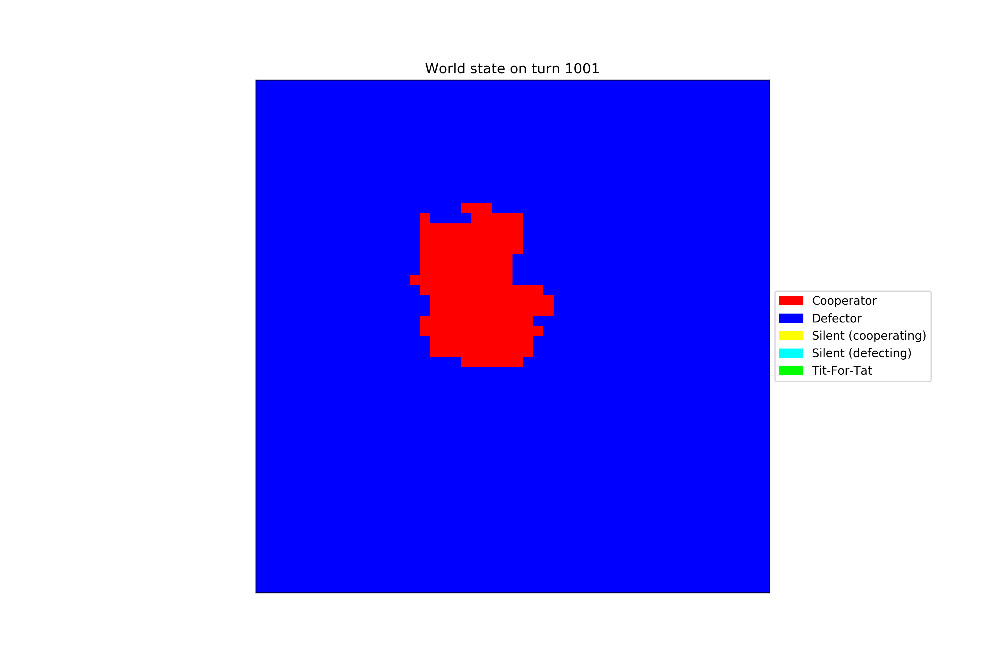
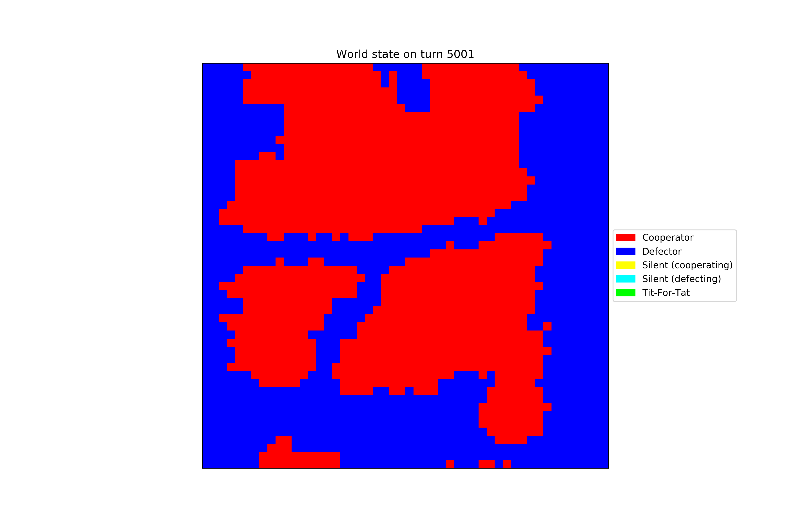
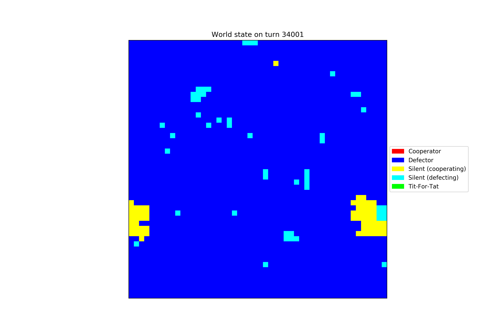

# Cooperation Emergence in a Greedy Society
Adam Selker & Nick Sherman

## Abstract
Cooperation in a species seems counterintuitive to the idea of "survival of the fittest," as although cooperation as a whole can help a species, greediness can help an individual more. Our aim was to explore possible ways that cooperation appears in a population, in order to better understand how it may begin and how it could overcome greedy strategies for survival. In order to understand this, we simulate a variety of ways that cooperation could emerge in bacterial colonies on a biofilm, as seen in Hashem et al. Through this research, we determined that cooperation can successfully emerge through such strategies as a "silent cooperator" gene or through a "tit-for-tat" strategy, where cells will cooperate with neighbors that cooperated or defect with those who defect.


## Overview
In this experiment, we built a computational model that represents a biofilm. Each cell in a two-dimensional grid represents a cell with a simple genome. Each cell can mutate, replicate into other spaces (killing those cells' previous occupants), or be killed when another cell replicates into its space.

Replication is controlled by fitness, which is driven by two factors. First, each cell has a general fitness gene, which is intended to represent all the genes not included in this model. The general fitness gene is initialized with a value of 0, i.e. having no effect; in some simulations, it is randomly incremented to represent helpful mutations.

The second factor is the Prisoner's Dilemma (PD) games which the cells play against each other. Each cell can "cooperate" or "defect" with other cells; both cells' actions affect the fitness scores of both. Cooperating decreases the cooperator's fitness, but increases the fitness of the other cells by a greater amount; defecting is a net loss of fitness, but helps the defector. The payoff matrix for cell A playing against cell B is shown in figure N.

|   | A Cooperator   | A Defector |
|---|---|---|
| B Cooperator | 1 - u | 1 |
| B Defector | -u | 0 |

Figure 1: Prisoner's Dilemma payoff matrix for A

The constant u was set to 0.09 in the original work of Hashem et al., but was tested with multiple different values during our experimentation. The PD is played against every cell within 3 spaces, with payoffs decreasing as distance increases. The grid of weights is shown in Fig. 2 and Fig. 3.

```
1 / 3, 1 / 3, 1 / 3, 1 / 3, 1 / 3, 1 / 3, 1 / 3
1 / 3, 1 / 2, 1 / 2, 1 / 2, 1 / 2, 1 / 2, 1 / 3
1 / 3, 1 / 2,     1,     1,     1, 1 / 2, 1 / 3
1 / 3, 1 / 2,     1,     X,     1, 1 / 2, 1 / 3
1 / 3, 1 / 2,     1,     1,     1, 1 / 2, 1 / 3
1 / 3, 1 / 2, 1 / 2, 1 / 2, 1 / 2, 1 / 2, 1 / 3
1 / 3, 1 / 3, 1 / 3, 1 / 3, 1 / 3, 1 / 3, 1 / 3
```
Figure 2: Cells play the PD against every other cell within 3 spaces, with varying weights.


Figure 3: The PD weights, represented as a heatmap.

Each cell cooperates or defects according to its genome. There are three "behavior" alleles: Cooperate (C), which always cooperates; Defect (D), which always defects; and Silent (S), which defects for a time and then begins to cooperate. The "timer" that controls the transition is initialized (exponentially distributed, with a mean of 200 steps) when a cell mutates into the S strategy, and is passed on if it replicates.

Replication is controlled by fitness. During each timestep, each cell plays the PD against its neighbors, and the results are summed. The cell's general fitness factor is added, to produce the cell's fitness. Then, the cell is compared to a random one of its neighbors. If the neighbor's fitness is higher, the neighbor might invade, with a probability (F_2 - F_1)/k, where F_2 is the invading cell's fitness, F_1 is the invaded cell's fitness, and k is a constant equal to 24 + 24u.


## Experiments
### Experiment 1: Basic System replication
The first step of the experiment is to show that if a cluster of cooperators exists, it can expand and dominate the biofilm. To test this, we simulate a biofilm without mutation. A square of varying size in the center of the film is initialized with cooperators, and the rest of the film is filled with defectors. Our experiment differs from the original Hashem et al. experiment due to the u value being decreased from 0.09 to 0.07; we maintained this through the rest of the experiments.


#### Results of Experiment 1
Hashem et al. found that when the square of cooperators is smaller than 6x6, it tends to be taken over by defectors; when it is 6x6 or larger, it tends to expand. In order to test our model's similarity, we tested multiple times at a 5x5 grid, and find that the cooperators survive and propogate in a pattern qualitatively similar to the patterns found in Hashem et al., where cooperators occupy the majority of the biofilm with bands of defectors existing. The development of this can be seen in Figures 4-8. The count of cooperators over time can be seen in Figure 9.



Figure 4: The starting state of a 5x5 block of cooperators in experiment 1.



Figure 5: The state of a 5x5 block of cooperators after 1001 timesteps.



Figure 6: The state of a 5x5 block of cooperators after 5001 timesteps.


Figure 7: The state of a 5x5 block of cooperators after 10001 timesteps.


Figure 8: The state of a 5x5 block of cooperators after 20,000 timesteps, at the end of the experiment.


Figure 9: The number of each type of agent over time.


We also tested a 3x3 starting group of cooperating cells, and saw that within 500 timesteps they died out, as seen in Figures 10 and 11. This corroborates Hashem et al, and suggests that our environment is a reasonable approximation as the behavior that we are observing is qualitatively close to what they observed.


Figure 10: This simulation begins with a 3x3 block of cooperators.


Figure 11: After 500 timesteps, all of the cooperators are gone.


### Experiment 2: Mutation
Once we have established that a sufficiently-sized cluster of cooperators will spread across the biofilm, we investigate how these clusters can arise. In our second experiment, we remove the starting cluster of cooperators, and add a chance of mutation. Mutations can happen to the general fitness gene, the behavior gene, or both, as specified in the Overview. The silent-cooperator allele is disabled; all cells become regular cooperators when mutating. We use a mutation rate of 1e-4 as in the original paper for results published. We also ran the test for 100,000 time steps, as in the original paper.

#### Results of Experiment 2
We expected the grid to be stably full of defectors, with a few cooperators occurring randomly but never spreading, and this is what we observe. It is consistent with Hashem et al.'s findings. We also confirmed these results for mutation rates of 1e-2 and 1e-3. Cooperators often appear, but they disappear just as quickly.

  

Figure 12: The starting state of the world in experiment 2 (only defectors).

  

Figure 13: The state of the world on step 50,000. There are a few cooperators, but the world is still dominated by defectors.

  

Figure 14: The ending state of the world on step 100,000. Nothing significant has changed since step 50,000.

  

Figure 15: The number of cooperator and defector cells over time. 

### Experiment 3: Add silent-cooperator state
The third experiment involves adding a silent-cooperator allele. A silent cooperator defects for a certain number of timesteps, and then begins to cooperate. If a silent cooperator reproduces, the child cell inherits the parent's running clock, so they will both begin to cooperate at the same time. The amount of time before activation was exponentially distributed with a mean of 200 time steps; this was the same in Hashem et al.

If, at some point, a cell evolves a high general-fitness gene and also becomes a silent cooperator, it might spread while still defecting. Eventually, its children all begin to cooperate at once, potentially kick-starting the cooperator dominance seen in Experiment 1. 

#### Results of Experiment 3
Although cooperators occasionally dominated for short periods, they did not maintain dominance. This is different from Hashem et al., which found that the cooperators would eventually expand and fill the whole grid, as in Experiment 1. The change over time can be observed in Figures 17-19, where the spike around timestep 40,000 begins expanding around timestep 34,000 and drops down again around step 46,000.


  

Figure 16: The number of each kind of agent over time for experiment 3.

  

Figure 17: The state of the game on step 34,001.

  

Figure 18: The state of the game on step 40,001.

  

Figure 19: The state of the game on step 46,001.


### Experiment 4: Simplified Tit for Tat Strategy
The strategies that cells follow in previous experiments are relatively simple, either exclusively cooperating, defecting, or waiting until a certain time step to cooperate. One common strategy that is successful in Prisoner's Dilemma tournaments is the tit-for-tat strategy, which takes the same action that its opponent took in the last round. In this simulation, the PD is played against multiple opponents at the same time, so we used a weighted average of opponents' actions (weighted by the same grid used in the PD payouts; see Fig. 2). If more than 40% of opponents cooperated, the cell would cooperate. Otherwise, it would defect.

This experiment started with a 6x6 block of tit-for-tat players, with the rest of the grid full of defectors. We ran this simulation for 10,000, reduced from prior experiments' 100,000 steps due to a larger computation requirement.

#### Results of Experiment 4
The tit-for-tat players' growth was unlike anything we observed prior or that Hashem et al. observed. As seen in Figure 22, the number of Tit-for-Tat following cells mostly plateaus for around 3,000 timesteps, only gradually increasing. However, around step 3000, the population begins to grow more quickly. After this point, the growth resembles that in Experiment 1.

  
Figure 20: The starting state of the world.

  
Figure 21: By 1000 steps, the tit-for-tat players are beginning to expand.

  
Figure 22: At 2500 steps, the tit-for-tat players are still growing slowly.

  
Figure 23: At 3000 steps, the group suddenly begins to grow quickly.

  
Figure 24: By 4500 steps, the grid is mostly tit-for-tat players.

  
Figure 25: The state of the world over time.

The slow growth near the beginning is probably because of how the tit-for-tat players choose their actions. At the beginning, they all defect. The cells on the corners of the block are exposed to more defectors than fellow tit-for-tat players; regardless of the other tit-for-tat cells' actions, those cells will feel more defection than cooperation, and will therefore begin to defect. This will "spread" inward until all of the cells are defecting, leaving the tit-for-tat players as nothing but ordinary defectors.

Eventually, they begin to cooperate. We are unsure of the trigger for this; regardless, at some point (around turn 3000 in this run), some small group begins to cooperate, and the rest quickly follow. At this point, each tit-for-tat player has enough cooperative neighbors to cooperate reliably, and they spread quickly.


## Interpretation
The goal of this experiment was to investigate how cooperation can emerge. There are two core insights: first, that clusters of cooperators can survive and expand in an environment of defectors, but only if they are of a certain size; and second, that "silent cooperators" can form such clusters though genetic hitchhiking. Before getting into this, we want to make the point that our simulation environment is harsher than the environment that Hashem et al. produced. We needed to lower the punishment for cooperating in order to obtain results similar to the original paper, and although we needed fewer cells to replicate their results it was not by a large margin.

The first experiment provided the insight that once exceeding a critical mass, cooperators are able to dominate a biofilm. This insight is critical for proving that cooperation can help a species overall and is beneficial to evolve. The first experiment also gave some insight as to the size of block needed for this to happen, which appears to be about 5x5 cells. Experiment 2 backed this up by showing that individual cooperators cannot survive.

The second insight can be derived from Experiments 2 and 3. Where randomly-mutated cooperators failed, silent cooperators sometimes succeeded, their behavior alleles hitchhiking on randomly-high fitness caused by another factor (the general-fitness gene). The critical feature seems to be simultaneity, since that is the most important difference between silent cooperators and regular cooperators. Although the silent cooperators were unable to maintain sustained control of the biofilm, the experiment suggests that under different circumstances they could, which Hashem et al. support.


Finally, from Experiment 4 we learned that more complex strategies can work in the biofilm as we designed it. We did make significant compromises in complexity in order to save on computation time, which means in the future more complex strategies can be analyzed to see if they dominate more completely.

## Future Work
The agents considered thus far have only relatively simple strategies. A broader array of strategies could be implemented, including:
* Strategies which depend on other cells’ genomes
* Strategies which depend on other cells’ past behavior individually, not as a collective as we have implemented
* Strategies with more random elements
* Strategies which act differently based on cells’ relative positions
* Strategies which include longer memory

All work could also be tested more in-depth at the original 1e-4 learning rate and 100,000 time steps.

## Annotated bibliography

### The Silent Cooperate (Hashem et al.)
In “The Silent Cooperator”, Hashem et al. describe how some genetic behaviors can stay inactive until certain conditions are met. This can be advantageous for altruistic behaviors, which are fit in aggregate but not individually and so should only sometimes be expressed. 

The authors build a computational model of a biofilm in the form of a 2D grid of agents playing the Prisoner’s Dilemma (PD) against their neighbors, where each agent cooperates or defects according to its genes. Agents with better outcomes from the PD’s are more likely to reproduce to other cells in the grid, displacing the cell’s previous, lower-scoring genome and replacing it with a maybe-mutated copy of the winner’s genome. There is also some “fitness noise” associated with each genome, representing other sources of genetic variation in microbes.

Two genetic states, “C” and “D”, always cooperate and always defect, respectively. The third, “S”, defects until some time t’, at which point it begins to cooperate. This is referred to as a “silent cooperator”.

Small islands of cooperators in a sea of defectors tend to die out, but larger clusters spread until the biofilm consists of blobs of cooperators separated by thin bands of defectors. If, instead of adding an initial island, a mutation rate is added, then cooperators never catch on -- but silent cooperators sometimes do, since the random noise associated with genetic fitness sometimes creates clusters of silent cooperators, which all switch to cooperating at the same time.

I. Hashem, D. Telen, P. Nimmegeers, and J. Van Impe, “The Silent Cooperator: An Epigenetic Model for Emergence of Altruistic Traits in Biological Systems,” _Complexity_, vol. 2018, Article ID 2082037, 16 pages, 2018. https://doi.org/10.1155/2018/2082037.


## Where's our work?

Curious in checking out what we did? You can find our repository at https://github.com/aselker/cooperation_emergence/ or use our online Binder notebook.
[](https://mybinder.org/v2/gh/aselker/cooperation_emergence/master?filepath=%2Fcode%2FJupyter%20Notebook.ipynb)
