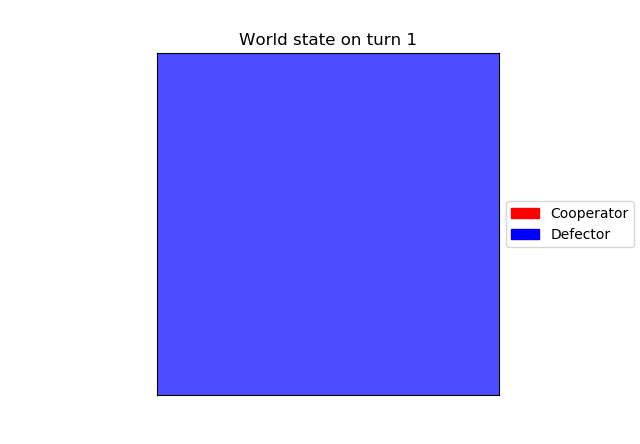

# Cooperation Emergence in a Greedy Society
Adam Selker & Nick Sherman

## Abstract
Cooperation in a species seems counterintuitive to the idea of "survival of the fittest," as although cooperation as a whole can help a species, greediness can help an individual more. Our aim was to explore possible ways that cooperation appears in a population, in order to better understand how it may begin and how it could overcome greedy strategies for survival. In order to understand this, we simulate a variety of ways that cooperation could emerge in bacterial colonies on a biofilm, as seen in Hashem et al. Through this research, we determined that cooperation can successfully emerge through such strategies as a "silent cooperator" gene or through a "tit-for-tat" strategy, where cells will cooperate with neighbors that cooperated or defect with those who defect.


## Overview
In this experiment, we built a computational model that represents a biofilm.  Each cell in a two-dimensional grid represents a cell, which has a simple genome, and can mutate, replicate into other spaces (killing those cells' previous occupants), or be killed when another cell replicates into its space.

Replication is controlled by fitness, which is driven by two factors.  First, each cell has a general fitness gene, which is intended to represent the effects of all of the cell's genes which are not represented in this model.  The general fitness gene is initialized with a value of 0, meaning "no effect"; in some simulations, it is randomly incremented to represent helpful mutations.

The second factor is the Prisoner's Dilemma (PD) games which the cells play against each other.  Each cell can "cooperate" or "defect" with other cells; both cells' actions affect the fitness scores of both.  Cooperating decreases the cooperator's fitness, but increases the fitness of the other cells by a greater amount; defecting is a net loss of fitness, but helps the defector.  The payoff matrix for cell A playing against cell B is shown in figure N.

|   | A Cooperator   | A Defector |
|---|---|---|
| B Cooperator | 1 | 1 + u |
| B Defector | 0 | u |

Figure 1: Prisoner's Dilemma payoff matrix for A

The constant u is set to 0.09 in this simulation.  The PD is played against every cell within 3 spaces, with payoffs decreasing as distance increases.  The grid of weights is shown in Fig. 2 and Fig. 3.

```
1 / 3, 1 / 3, 1 / 3, 1 / 3, 1 / 3, 1 / 3, 1 / 3
1 / 3, 1 / 2, 1 / 2, 1 / 2, 1 / 2, 1 / 2, 1 / 3
1 / 3, 1 / 2,     1,     1,     1, 1 / 2, 1 / 3
1 / 3, 1 / 2,     1,     X,     1, 1 / 2, 1 / 3
1 / 3, 1 / 2,     1,     1,     1, 1 / 2, 1 / 3
1 / 3, 1 / 2, 1 / 2, 1 / 2, 1 / 2, 1 / 2, 1 / 3
1 / 3, 1 / 3, 1 / 3, 1 / 3, 1 / 3, 1 / 3, 1 / 3
```
Figure 2: Cells play the PD against every other cell within 3 spaces, with varying weights.


Figure 3: The PD weights, represented as a heatmap.

 Each cell cooperates or defects according to its genome.  There are three "behavior" alleles: Cooperate (C), which always cooperates; Defect (D), which always defects; and Silent (S), which defects for a time and then begins to cooperate.  The "timer" that controls the transition is initialized (exponentially distributed, with a mean of 200 steps) when a cell mutates into the S strategy, and is passed on if it replicates.


Replication is controlled by fitness.  During each timestep, each cell plays the PD against its neighbors, and the results are summed.  The cell's general fitness factor is added, to produce the cell's fitness.  Then, the cell is compared to a random one of its neighbors.  If the neighbor's fitness is higher, the neighbor might invade, with a probability (F_2 - F_1)/k, where F_2 is the invading cell's fitness, F_1 is the invaded cell's fitness, and k is a constant equal to 24 + 24u.


## Experiments
### Experiment 1: Basic System replication
The first step of the experiment is to prove that if a cluster of cooperators exists, it can expand and dominate the biofilm.  To test this, we simulate a biofilm without mutation.  A square of varying size in the center of the film is initialized with cooperators, and the rest of the film is filled with defectors.


Figure 3: An example of experiment 1 where a 5x5 block of cooperators survives and dominates the system.


Figure 4: An example of experiment 1 where a 5x5 block of cooperators dies off.

#### Results of Experiment 1
Hashem et al. found that when the square of cooperators is smaller than 6x6, it tends to be taken over by defectors; when it is 6x6 or larger, it tends to expand.  In order to test our model's similarity, we test multiple times at a 5x5 grid, and find that the cooperators might survive or die out, depending on luck. Two sample runs can be seen below. 4x4 cooperator blocks reliably die out, and 6x6 cooperator blocks reliably survive.

The results of our first experiment show that, while the system is not totally deterministic, groups of cooperators do seem to expand if they reach a critical size of around 5x5.  In contrast to Hashem et al., 5x5 clusters seem unstable; the other results are consistent with their findings.

### Experiment 2: Mutation
Once we have established that a sufficiently-sized cluster of cooperators will spread across the biofilm, we investigate how these clusters can arise.  In our second experiment, we remove the starting cluster of cooperators, and add a chance of mutation.  Mutations can happen to the general fitness gene, the behavior gene, or both, as specified in the Overview.  The silent-cooperator allele is disabled; all cells become regular cooperators when mutating. We use a mutation rate of 1e-4 as in the original paper for results published, but also ran tests at 1e-2 and 1e-3.  Because of limited computational resources, we only ran the simulations for 10,000 steps, rather than the 100,000 steps used in the original paper.

#### Results of Experiment 2
We expect the grid to be stably full of defectors, with a few cooperators occurring randomly but never spreading.  This is in fact what we observe.  It is consistent with Hashem et al.'s findings. We also confirmed these results for mutation rates of 1e-2 and 1e-3. Below is a few snapshots of the world during its development.

  

Figure 5: The starting state of the world.

  

Figure 6: The state of the world after 2001 steps. Cooperators are beginning to appear.

  

Figure 7: The state of the world after 8001 steps. Defectors still dominate.


Figure 8: The state of the world after 10000 steps. As at step 8001, there are no cooperators alive.


Figure 9: The state of the world over time. The world is dominated by defectors, with cooperators providing only a bit of noise.

### Experiment 3: Add silent-cooperator state
The third experiment involves adding a silent-cooperator allele that means that a cell will become a cooperator after a certain number of timesteps. This means that the model will be run for a number of generations before the genes become "activate," resulting in sleeper agents that will awaken and begin being cooperative. Those with the gene will pass it on to other cells if they are successfully dominant early-on, resulting in clusters suddenly forming later on that are above the critical threshold for cooperator success. Within the experiment, the amount of time before activation was exponentially distributed with a mean of 200 time steps. A sample run of the experiment can be seen in the below sampling of images at steps 1, 1001, 3001, and 10000.

  
Figure 10: The starting state of the world.

  
Figure 11: The state of the world after 1001 steps. Cooperators are beginning to appear.

  
Figure 12: The state of the world after 3001 steps. Cooperators are beginning to control a majority of the world.

  
Figure 13: The state of the world after 10000 steps. Cooperators control a solid majority of the world and are slowly eliminating defectors.


#### Results of Experiment 3
Experiment 3 proves that cooperation can appear in a population of defectors if there is a trigger of some kind that causes a large body of cells to suddenly become cooperators. This aligns with what the original experiment was hoping to predict, but we had to make a small change of a higher mutation rate in order to achieve these results. Due in part to compute power and in part due to time limitations, we had to run experiments for 10,000 timesteps instead of 100,000 timesteps as in the original paper. Therefore, we had to increase the mutation rate and found that we need to increase it to 1e-2 from 1e-4. Further steps include trying to determine if a mutation rate of 1e-4 will work on the timeframe that Hashem et al. used. The number of each type of agent over time is plotted in the below graph.

  
Figure 14: The state of the world over time. Original "cooperators" do not exist.

### Experiment 4: Environment comparison to original paper
For most of our experiments, we did not have the compute power to run a direct comparison to the original Hashem et al. paper. Therefore, we used Olin College's supercomputer (Deepmind) to run a full-scale Experiment 3, using the original paper's 1e-4 mutation rate and 100,000 timesteps.

#### Results of Experiment 4
We found that the results were consistent with HaShem et al, and also with our Experiment 3.


Figure 9: The state of the world over time. The world is dominated by defectors until a group of silent cooperators emerge and take it over.

### Experiment 5: Simplified Tit for Tat Strategy
The strategies that cells follow in previous experiments are relatively simple, either exclusively cooperating, defecting, or waiting until a certain time step to cooperate. Although computational limitations were still in place, an exploration of a more complex strategy was in order. One common strategy that is successful in Prisoner's Dilemma tournaments is the tit-for-tat strategy, which takes the same action that its opponent took in the last round. In this simulation, the PD is played against multiple opponents at the same time, so we used a weighted average of opponents' actions (weighted by the same grid used in the PD payouts; see Fig. 2).  If more than 40% of opponents defected, the cell would defect.  Otherwise, it could cooperate.

As in Experiment 1, this experiment started with a 5x5 block of tit-for-tat players, with the rest of the grid full of defectors.

#### Results of Experiment 5
The tit-for-tat players did not survive or propagate.

  
Figure 15: The starting state of the world.

  
Figure 16: By 1000 steps, the tit-for-tat players are beginning to die out.

  
Figure 17: By 3000 steps, the tit-for-tat players are extinct.

  
Figure 18: The state of the world over time.  Defectors dominate.

This is probably because of how the tit-for-tat players choose their actions.  The cells on the corners of the block are exposed to more defectors than fellow tit-for-tat players; regardless of the other tit-for-tat cells' actions, those cells will feel more defection than cooperation, and will therefore begin to defect.  This will "spread" inward until all of the cells are defecting, leaving the tit-for-tat players as nothing but ordinary defectors.


## Interpretation
The goal of this experiment was to investigate how cooperation can emerge.  There are two core insights: first, that clusters of cooperators can survive and expand in an environment of defectors, but only if they are of a certain size; and second, that "silent cooperators" can form such clusters though genetic hitchhiking.  

The first insight can be derived from Experiment 1.  When the starting cluster was 4x4 or smaller, it was always overrun.  When the cluster was 6x6, it always expanded and took over most of the grid.  Experiment 2 showed that even with some random noise, individual cooperators cannot survive for long.

The second insight can be derived from Experiments 2 and 3.  Where randomly-mutated cooperators failed, silent cooperators sometimes succeeded, their behavior alleles hitchhiking on randomly-high fitness caused by another factor (the general-fitness gene).  The critical feature seems to be simultaneity, since that is the most important difference between silent cooperators and regular cooperators.

The third insight can be derived from experiment 4. This [proves/disproves] the fact that our smaller experiments with mutation rates of 1e-2 and time steps of 10,000 were valid simplification of the original experiments.

The final insights come from Experiment 5. In it, we determined that simplified strategies that look over the majority of neighbors  need to be seriously revised if used in this environment due to the overwhelming number of defectors that exist at the start of the simulation.

## Future Work
The agents considered thus far have only relatively simple strategies.  A broader array of strategies could be implemented, including:
* Strategies which depend on other cells’ genomes
* Strategies which depend on other cells’ past behavior individually, not as a collective as we have implemented
* Strategies with more random elements
* Strategies which act differently based on cells’ relative positions
* Strategies which include longer memory

All work could also be tested more in-depth at the original 1e-4 learning rate and 100,000 time steps.

## Annotated bibliography

### The Silent Cooperate (Hashem et al.)
In “The Silent Cooperator”, Hashem et al. describe how some genetic behaviors can stay inactive until certain conditions are met.  This can be advantageous for altruistic behaviors, which are fit in aggregate but not individually and so should only sometimes be expressed.  

The authors build a computational model of a biofilm in the form of a 2D grid of agents playing the Prisoner’s Dilemma (PD) against their neighbors, where each agent cooperates or defects according to its genes.  Agents with better outcomes from the PD’s are more likely to reproduce to other cells in the grid, displacing the cell’s previous, lower-scoring genome and replacing it with a maybe-mutated copy of the winner’s genome.  There is also some “fitness noise” associated with each genome, representing other sources of genetic variation in microbes.

Two genetic states, “C” and “D”, always cooperate and always defect, respectively.  The third, “S”, defects until some time t’, at which point it begins to cooperate.  This is referred to as a “silent cooperator”.

Small islands of cooperators in a sea of defectors tend to die out, but larger clusters spread until the biofilm consists of blobs of cooperators separated by thin bands of defectors.  If, instead of adding an initial island, a mutation rate is added, then cooperators never catch on -- but silent cooperators sometimes do, since the random noise associated with genetic fitness sometimes creates clusters of silent cooperators, which all switch to cooperating at the same time.

I. Hashem, D. Telen, P. Nimmegeers, and J. Van Impe, “The Silent Cooperator: An Epigenetic Model for Emergence of Altruistic Traits in Biological Systems,” _Complexity_, vol. 2018, Article ID 2082037, 16 pages, 2018. https://doi.org/10.1155/2018/2082037.


## Where's our work?

Curious in checking out what we did? You can find our repository at https://github.com/aselker/cooperation_emergence/ or use our online Binder notebook. 
[](https://mybinder.org/v2/gh/aselker/cooperation_emergence/master?filepath=%2Fcode%2FJupyter%20Notebook.ipynb)
