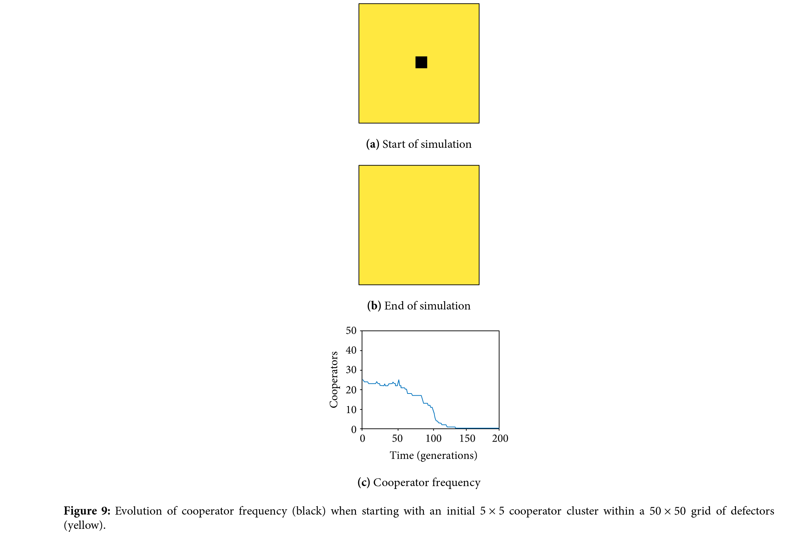
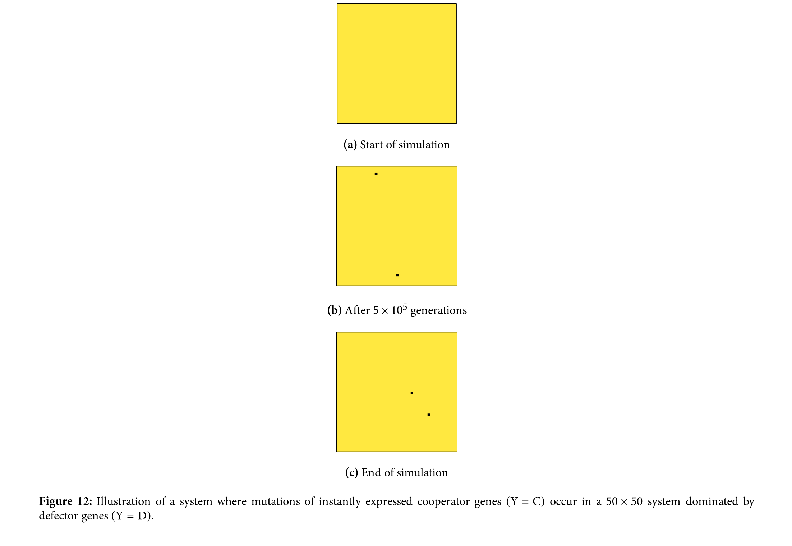
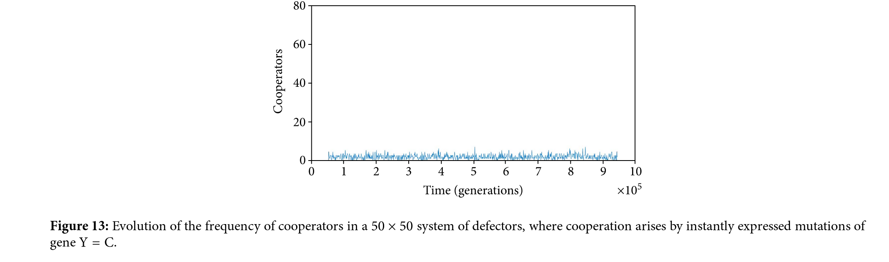
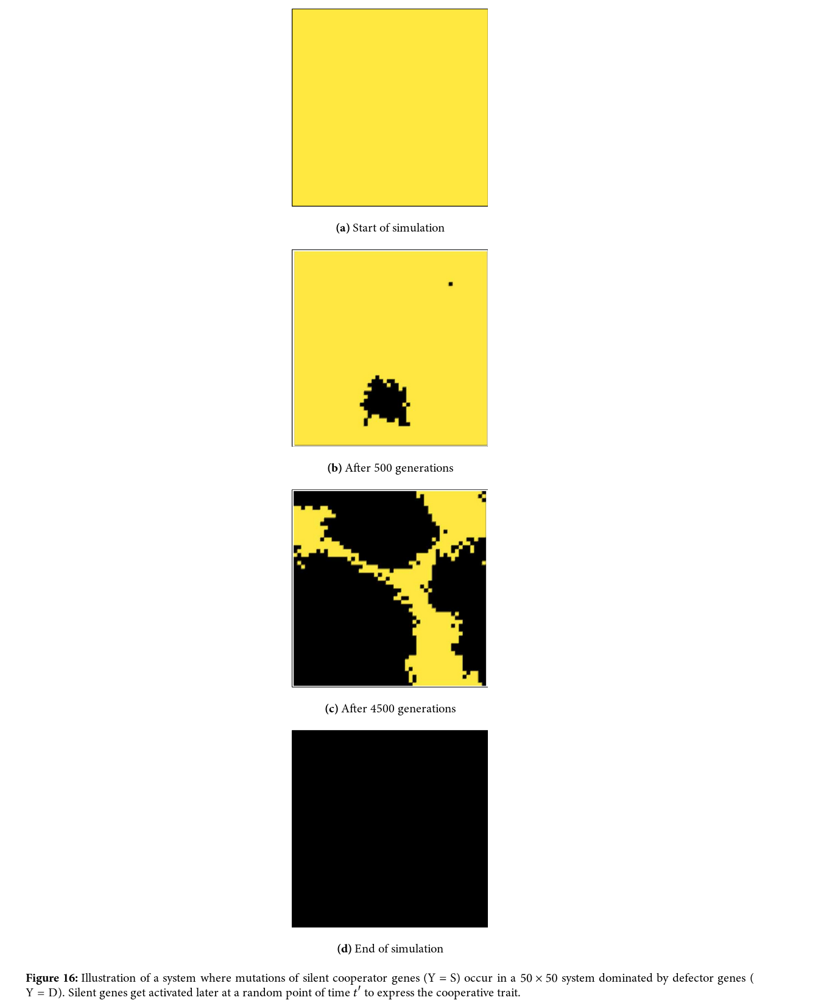
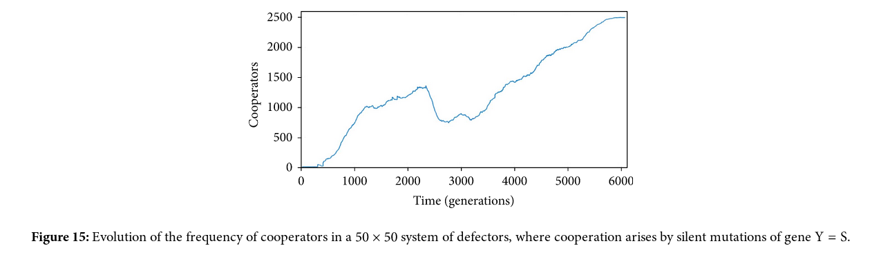

# Cooperation Emergence in a Greedy Society
Adam Selker & Nick Sherman

## Abstract
The intent of this project is to explore the emergence of cooperation from a greedy society. We will use Python to build a grid-based cellular automaton, where cells behave as “cooperators” or “defectors.” We will observe how the cooperators’ can become the dominant cell type in a system when for any given cell being a defector makes more sense.

## Annotated bibliography
In “The Silent Cooperator”, Hashem et al. describe how some genetic behaviors can stay inactive until certain conditions are met.  This can be advantageous for altruistic behaviors, which are fit in aggregate but not individually and so should only sometimes be expressed.  

The authors build a computational model of a biofilm in the form of a 2D grid of agents playing the Prisoner’s Dilemma (PD) against their neighbors, where each agent cooperates or defects according to its genes.  Agents with better outcomes from the PD’s are more likely to reproduce to other cells in the grid, displacing the cell’s previous, lower-scoring genome and replacing it with a maybe-mutated copy of the winner’s genome.  There is also some “fitness noise” associated with each genome, representing other sources of genetic variation in microbes.

Two genetic states, “C” and “D”, always cooperate and always defect, respectively.  The third, “S”, defects until some time t’, at which point it begins to cooperate.  This is referred to as a “silent cooperator”.

Small islands of cooperators in a sea of defectors tend to die out, but larger clusters spread until the biofilm consists of blobs of cooperators separated by thin bands of defectors.  If, instead of adding an initial island, a mutation rate is added, then cooperators never catch on -- but silent cooperators sometimes do, since the random noise associated with genetic fitness sometimes creates clusters of silent cooperators, which all switch to cooperating at the same time.

I. Hashem, D. Telen, P. Nimmegeers, and J. Van Impe, “The Silent Cooperator: An Epigenetic Model for Emergence of Altruistic Traits in Biological Systems,” _Complexity_, vol. 2018, Article ID 2082037, 16 pages, 2018. https://doi.org/10.1155/2018/2082037.

### Experiment 1: Basic System replication
For our first experiment, we need to build a basic world that allows us to model the cells as cooperators or defectors, and create behavior that replicates what the paper demonstrated. What this will consist of is some cellular automata system that exists in a world where every location has a cell, and the cell interacts with its neighbors regarding food obtaining. The goal here is to build a basic model to be expanded upon in future experiments

#### Results of Experiment 1
The results of Experiment 1 should lead to a near-deterministic system that will allow defectors to take over if there aren’t enough cooperators or will allow cooperators to dominate, leaving strips of defectors as in the original paper. A sample image of this can be seen below, taken from the original paper.

### Experiment 2: Mutation
In our second experiment, we will add random mutations to agents’ genomes, both of the behavior section (cooperate or defect) and of the random-fitness section.  We will also remove the initial island of cooperators.

#### Results of Experiment 2
We expect the grid to be stably full of defectors, with a few cooperators occurring randomly but never spreading.

(Figures copied from the original paper)

### Experiment 3: Add silent-cooperator state
The next part of the experiment involves adding a silent-cooperator “state” that means that a cell will become a cooperator after a certain number of timesteps. This means that the model will be run for a number of generations before the genes become “activate,” resulting in sleeper agents that will awaken and begin being cooperative. Those with the gene will pass it on to other cells if they are successfully dominant early-on, resulting in clusters suddenly forming later on that are above the critical threshold for cooperator success.

#### Results of Experiment 3
For experiment 3, we expect there to be no cooperators at first, but when a group of cooperators appears that is large enough to be above the critical size, we expect to see them gradually take over the entire region as seen in the below image, taken from the original paper.

(Figures copied from the original paper)

### Experiment 4 (extension): Other Strategies
The agents considered thus far only choose to cooperate or defect based on their own genome.  A broader array of strategies could be implemented, including:
* Strategies which depend on other cells’ genomes
* Strategies which depend on other cells’ past behavior
* Strategies with random elements
* Strategies which act differently based on cells’ relative positions

#### Results of Experiment 4
Experiment 4’s results will vary heavily on the details of what we implement.  It seems likely that more “intelligent” strategies, such as tit-for-tat with noise and forgiveness, might dominate both defectors and cooperators due to their ability to cooperate with each other and defect against less-intelligent agents.  There may also be dynamic equilibria when strategies have multi-way rock-paper-scissors dominance over each other.

## Interpretation
When looking at this project, the whole goal is to understand how cooperation evolves at a societal level because although cooperation can help a species flourish, it seems counter-intuitive at an individual level to be cooperative. Therefore, the results of different tests should allow us to understand different hypothetical roots of where cooperation arose from.

The first experiment’s results make sense--if there is a large enough cooperative group they should dominate due to the benefits of cooperation; if there aren’t enough then they should be quickly eliminated due to not being fit enough in the landscape. This only proves that after a certain size cooperative groups can be successful however, and don’t explain how those cooperative groups form.

The second experiment shows that cooperation appearing in isolation almost always results in failure due to losing the benefits of being near other cooperative entities. This proves that when looking for the root of cooperation, we shouldn’t be looking for a gradual takeover in a society, but instead look for a sudden leap in cooperative entities.

The third experiment’s results show one possible model of cooperative appearance, where agents all suddenly have a silent cooperator gene become activated. This makes sense as a method of success, because the number of cooperators are relatively limited (as when cooperation appears it normally gets quickly eliminated), until a non trivially-sized group appears, which then follows the properties shown in the first experiment. This may differ and completely take over the group depending on how much more successful the cooperative cells are, and based on how many cells have a cooperative gene that become expressed later in their lifespan.

The fourth experiment’s results will allow us to understand what other ways cooperative behavior can end up appearing in groups of organisms. We expect that “intelligent” strategies will be most successful and that organisms which display a higher level of thought will rule due to what has (seemingly) happened on Earth, but we could still be surprised in our modelling.

## Causes for Concern

The biggest cause for concern is that we don’t have a great knowledge base to build our model off of. However, they seem to have a relatively simple model and we should be able to implement a basic 2DCell array, similar to classes we have already implemented in this class.

The other causes for concern we have mostly revolve around runtime--we don’t want to be trapped running something on our laptop that ends up taking hours to run, and therefore are going to try our best to do smaller tests and to run our project either in Google Colab or on Deep Thought if they begin to take too long.

## Next Steps

Our first next steps are to set up a good Github repo to collaborate on. After this, we will first build the simple world (we will have a 1-2 hour meeting before Sunday to do this). From there, we figure that until we get to the extensions we may as well pair program, since the tasks are fairly serial. We will continue having team meetings until this is completed (hopefully within a week), and will reevaluate next steps from there.
