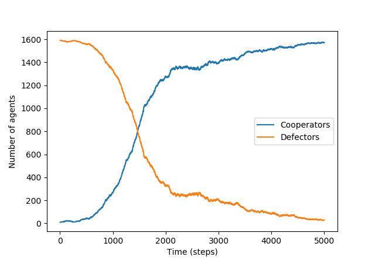
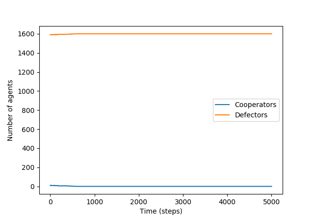

# Cooperation Emergence in a Greedy Society
Adam Selker & Nick Sherman


1) What is the application domain?  What is the system of interest?
2) What is the primary experimental question the authors address?
3) What kind of model do they use?
4) What methods do they apply to the model?   Analysis?  Simulation?
5) What work does the model do?  Predict?  Explain?  Design?
6) What validation do the authors report?
7) How are the results presented?  Is there a punchline figure?  How do we interpret it?
8) How do we interpret the results as an answer to the original question?

## Abstract
Cooperation in a species seems counterintuitive to the idea of "survival of the fittest," as although cooperation as a whole can help a species, greediness can help an individual more. Our aim was to explore possible ways that cooperation appears in a population, in order to better understand how it may begin and how it could overcome greedy strategies for survival. In order to understand this, we simulate a variety of ways that cooperation could emerge in bacterial colonies on a biofilm, as seen in Hashem et al. Through this research, we determined that cooperation can successfully emerge through such strategies as a "silent cooperator" gene and [something].


## Overview
In this experiment, we built a computational model that represents a biofilm.  Each cell in a two-dimensional grid represents a cell, which has a simple genome, and can mutate, replicate into other spaces (killing those cells' previous occupants), or be killed when another cell replicates into its space.

Replication is controlled by fitness, which is driven by two factors.  First, each cell has a general fitness gene, which is intended to represent the effects of all of the cell's genes which are not represented in this model.  The general fitness gene is initialized with a value of 0, meaning "no effect"; in some simulations, it is randomly incremented to represent helpful mutations.

The second factor is the Prisoner's Dilemma (PD) games which the cells play against each other.  Each cell can "cooperate" or "defect" with other cells; both cells' actions affect the fitness scores of both.  Cooperating decreases the cooperator's fitness, but increases the fitness of the other cells by a greater amount; defecting is a net loss of fitness, but helps the defector.  The payoff matrix for cell A playing against cell B is shown in figure N.

|   | A Cooperator   | A Defector |
|---|---|---|
| B Cooperator | 1 | 1 + u |
| B Defector | 0 | u |

Figure 1: Prisoner's Dilemma payoff matrix for A

The constant u is set to 0.09 in this simulation.  The PD is played against every cell within 3 spaces, with payoffs decreasing as distance increases.  The grid of weights is shown in figure M.

```
1 / 3, 1 / 3, 1 / 3, 1 / 3, 1 / 3, 1 / 3, 1 / 3
1 / 3, 1 / 2, 1 / 2, 1 / 2, 1 / 2, 1 / 2, 1 / 3
1 / 3, 1 / 2,     1,     1,     1, 1 / 2, 1 / 3
1 / 3, 1 / 2,     1,     X,     1, 1 / 2, 1 / 3
1 / 3, 1 / 2,     1,     1,     1, 1 / 2, 1 / 3
1 / 3, 1 / 2, 1 / 2, 1 / 2, 1 / 2, 1 / 2, 1 / 3
1 / 3, 1 / 3, 1 / 3, 1 / 3, 1 / 3, 1 / 3, 1 / 3
```
Figure M: Cells play the PD against every other cell within 3 spaces, with varying weights.

 Each cell cooperates or defects according to its genome.  There are three "behavior" alleles: Cooperate (C), which always cooperates; Defect (D), which always defects; and Silent (S), which defects for a time and then begins to cooperate.  The "timer" that controls the transition is initialized (exponentially distributed, with a mean of 200 steps) when a cell mutates into the S strategy, and is passed on if it replicates.


Replication is controlled by fitness.  During each timestep, each cell plays the PD against its neighbors, and the results are summed.  The cell's general fitness factor is added, to produce the cell's fitness.  Then, the cell is compared to a random one of its neighbors.  If the neighbor's fitness is higher, the neighbor might invade, with a probability (F_2 - F_1)/k, where F_2 is the invading cell's fitness, F_1 is the invaded cell's fitness, and k is a constant equal to 24 + 24u.


## Experiments
### Experiment 1: Basic System replication
The first step of the experiment is to prove that if a cluster of cooperators exists, it can expand and dominate the biofilm.  To test this, we simulate a biofilm without mutation.  A square of varying size in the center of the film is initialized with cooperators, and the rest of the film is filled with defectors.


Figure 2: An example of experiment 1 where a 5x5 block of cooperators survives and dominates the system.


Figure 3: An example of experiment 1 where a 5x5 block of cooperators dies off.

#### Results of Experiment 1
Hashem et al. found that when the square of cooperators is smaller than 6x6, it tends to be taken over by defectors; when it is 6x6 or larger, it tends to expand.  In order to test our model's similarity, we test multiple times at a 5x5 grid, and find that the cooperators might survive or die out, depending on luck. Two sample runs can be seen below. 4x4 cooperator blocks reliably die out, and 6x6 cooperator blocks reliably survive.

The results of our first experiment show that, while the system is not totally deterministic, groups of cooperators do seem to expand if they reach a critical size of around 5x5.  In contrast to Hashem et al., 5x5 clusters seem unstable; the other results are consistent with their findings.

### Experiment 2: Mutation
Once we have established that a sufficiently-sized cluster of cooperators will spread across the biofilm, we investigate how these clusters can arise.  In our second experiment, we remove the starting cluster of cooperators, and add a chance of mutation.  Mutations can happen to the general fitness gene, the behavior gene, or both, as specified in the Overview.  The silent-cooperator allele is disabled; no cell can mutate into it.

#### Results of Experiment 2
We expect the grid to be stably full of defectors, with a few cooperators occurring randomly but never spreading.  This is in fact what we observe.  It is consistent with Hashem et al.'s findings.

TODO: Add our own images here.


### Experiment 3: Add silent-cooperator state
The third experiment involves adding a silent-cooperator allele that means that a cell will become a cooperator after a certain number of timesteps. This means that the model will be run for a number of generations before the genes become "activate," resulting in sleeper agents that will awaken and begin being cooperative. Those with the gene will pass it on to other cells if they are successfully dominant early-on, resulting in clusters suddenly forming later on that are above the critical threshold for cooperator success. Within the experiment, the amount of time before activation was exponentially distributed with a mean of 200 time steps. 


#### Results of Experiment 3
For experiment 3, we expect there to be no cooperators at first, but when a group of cooperators appears that is large enough to be above the critical size, we expect to see them gradually take over the entire region as seen in the below image, taken from the original paper.

TODO: Add our own images here.


### Experiment 4 (extension): Other Strategies
The agents considered thus far only choose to cooperate or defect based on their own genome.  A broader array of strategies could be implemented, including:
* Strategies which depend on other cells’ genomes
* Strategies which depend on other cells’ past behavior
* Strategies with random elements
* Strategies which act differently based on cells’ relative positions

As of now, we focused on documenting the other experiments and discussing our current results. The strategies we will be pursuing are strategies with more random elements

#### Results of Experiment 4
Experiment 4’s results will vary heavily on the details of what we implement.  It seems likely that more “intelligent” strategies, such as tit-for-tat with noise and forgiveness, might dominate both defectors and cooperators due to their ability to cooperate with each other and defect against less-intelligent agents.  There may also be dynamic equilibria when strategies have multi-way rock-paper-scissors dominance over each other.

## Interpretation
TODO: Add interpretation of Experiment 4.

The goal of this experiment was to investigate how cooperation can emerge.  There are two core insights: first, that clusters of cooperators can survive and expand in an environment of defectors, but only if they are of a certain size; and second, that "silent cooperators" can form such clusters though genetic hitchhiking.  

The first insight can be derived from Experiment 1.  When the starting cluster was 4x4 or smaller, it was always overrun.  When the cluster was 6x6, it always expanded and took over most of the grid.  Experiment 2 showed that even with some random noise, individual cooperators cannot survive for long.

The second insight can be derived from Experiments 2 and 3.  Where randomly-mutated cooperators failed, silent cooperators sometimes succeeded, their behavior alleles hitchhiking on randomly-high fitness caused by another factor (the general-fitness gene).  The critical feature seems to be simultaneity, since that is the most important difference between silent cooperators and regular cooperators.

## Future Work

## Annotated bibliography

### The Silent Cooperate (Hashem et al.)
In “The Silent Cooperator”, Hashem et al. describe how some genetic behaviors can stay inactive until certain conditions are met.  This can be advantageous for altruistic behaviors, which are fit in aggregate but not individually and so should only sometimes be expressed.  

The authors build a computational model of a biofilm in the form of a 2D grid of agents playing the Prisoner’s Dilemma (PD) against their neighbors, where each agent cooperates or defects according to its genes.  Agents with better outcomes from the PD’s are more likely to reproduce to other cells in the grid, displacing the cell’s previous, lower-scoring genome and replacing it with a maybe-mutated copy of the winner’s genome.  There is also some “fitness noise” associated with each genome, representing other sources of genetic variation in microbes.

Two genetic states, “C” and “D”, always cooperate and always defect, respectively.  The third, “S”, defects until some time t’, at which point it begins to cooperate.  This is referred to as a “silent cooperator”.

Small islands of cooperators in a sea of defectors tend to die out, but larger clusters spread until the biofilm consists of blobs of cooperators separated by thin bands of defectors.  If, instead of adding an initial island, a mutation rate is added, then cooperators never catch on -- but silent cooperators sometimes do, since the random noise associated with genetic fitness sometimes creates clusters of silent cooperators, which all switch to cooperating at the same time.

I. Hashem, D. Telen, P. Nimmegeers, and J. Van Impe, “The Silent Cooperator: An Epigenetic Model for Emergence of Altruistic Traits in Biological Systems,” _Complexity_, vol. 2018, Article ID 2082037, 16 pages, 2018. https://doi.org/10.1155/2018/2082037.

### Other_source
http://www.math.harvard.edu/archive/153_fall_04/Additional_reading_material/spatial_dilemmas_of_evolution.pdf


## Where's our work?

Curious in checking out what we did? You can find our repository at ___________ or use our online notebooke through ___________.
